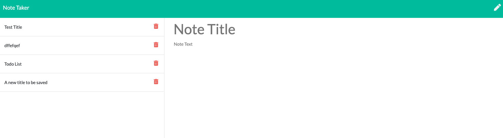
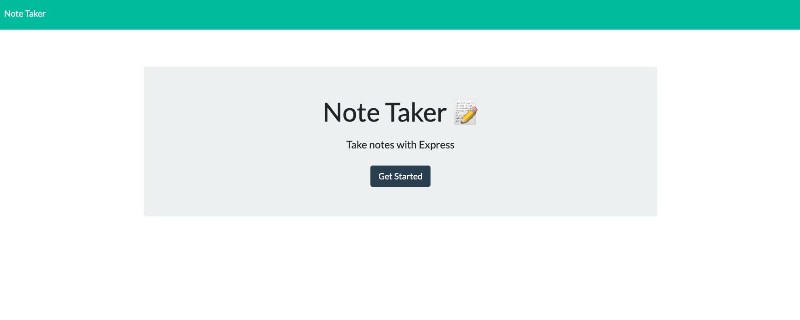
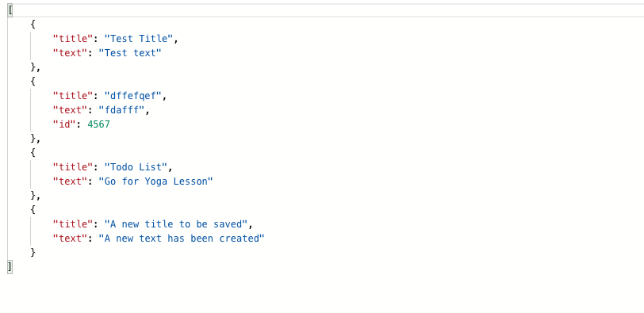
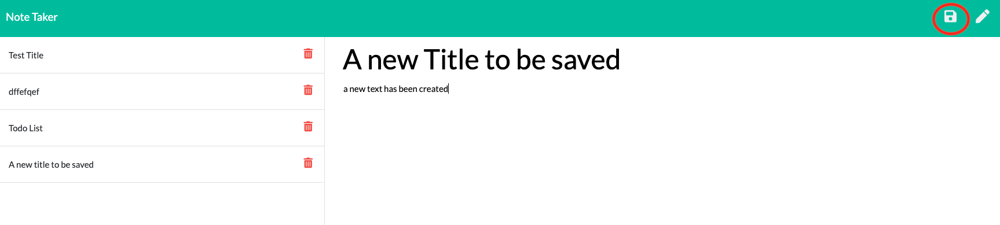
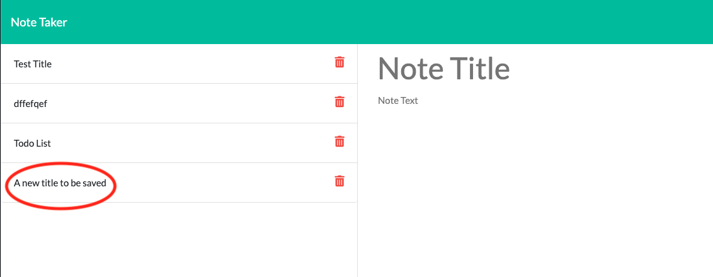

# Unit 11 Express Homework: Note Taker

https://week11-note-taker.herokuapp.com/notes

## Description

Create an application that can be used to write, save, and delete notes. This application will uses express backend and save and retrieve note data from a JSON file.

- The application frontend was created, I built the backend and connected the two.

- The following HTML routes are used:

  - GET `/notes` returns the `notes.html` file. 

* GET `*` returns the `index.html` file. 

- The notes are stored in a `db.json` file on the backend. The `fs` module is used to read and write to this file.

* The following API royes were created:

  - GET `/api/notes` reads the `db.json` file and return all saved notes as JSON. 

  - POST `/api/notes` receives a new note to save on the request.body, add it to the `db.json` file, and then return the new note to the client when the save icon is clicked. Here is the screen shot before saving (with the save icon circled): 

And this is the screen shot after it's been saved, with the title circled: 

- DELETE `/api/notes/:id` receives a query paramter containing the id of a note to delete when the trash can next to the corresponding title is clicked. The note is deleted from the list and from the `db.json` file.

## User Story

AS A user, I want to be able to write and save notes

I WANT to be able to delete notes I've written before

SO THAT I can organize my thoughts and keep track of tasks I need to complete

## Business Context

For users that need to keep track of a lot of information, it's easy to forget or be unable to recall something important. Being able to take persistent notes allows users to have written information available when needed.

## PROJECT TITLE:

 Day Planner

## PROBLEM DESCRIPTION:

Poor time management can result in missed meetings and deadlines or create the appearance of unprofessionalism.

## SOLUTION:

A daily planner that allows employees to see their day at a glance, schedule time effectively and, hence, improve productivity.

## USER STORY:

AS AN employee with a busy schedule
I WANT to add important events to a daily planner
SO THAT I can manage my time effectively 

## USER STORY ACCEPTANCE TEST

GIVEN that an employee adds events to a specific hour in a calendar
WHEN the employee clicks the save button
THEN events are saved in the timeblock for that hour

## APPLICATION DESCRIPTION

### a) OPERATION

1. Current day is displayed at the top of the calendar.
2. The  Day Planner page represents typical work day hour of 9am to 5pm.
3. The page is divided into rows representing a timeblock of one hour as indicated in the left column.
4. Each timeblock is color coded to indicate  the past hours (light grey), present hour (red), or future hours (green).
5. A user enters their future event (meeting or task) in the appropriate timeblock input field.
6. To the right of the timeblock is a save button that, when clicked, will save the event to 'localStorage' 

### b) DEVELOPMENT

Technologies used web application include:

* HTML
* CSS
* Bootstrap
* JavaScript
* jQuery
* Heroku

## NEW SKILLS LEARNT

Heroku

## LICENSE

MIT License

Copyright (c) 2020 David Brown

Permission is hereby granted, free of charge, to any person obtaining a copy
of this software and associated documentation files (the "Software"), to deal
in the Software without restriction, including without limitation the rights
to use, copy, modify, merge, publish, distribute, sublicense, and/or sell
copies of the Software, and to permit persons to whom the Software is
furnished to do so, subject to the following conditions:

The above copyright notice and this permission notice shall be included in all
copies or substantial portions of the Software.

THE SOFTWARE IS PROVIDED "AS IS", WITHOUT WARRANTY OF ANY KIND, EXPRESS OR
IMPLIED, INCLUDING BUT NOT LIMITED TO THE WARRANTIES OF MERCHANTABILITY,
FITNESS FOR A PARTICULAR PURPOSE AND NONINFRINGEMENT. IN NO EVENT SHALL THE
AUTHORS OR COPYRIGHT HOLDERS BE LIABLE FOR ANY CLAIM, DAMAGES OR OTHER
LIABILITY, WHETHER IN AN ACTION OF CONTRACT, TORT OR OTHERWISE, ARISING FROM,
OUT OF OR IN CONNECTION WITH THE SOFTWARE OR THE USE OR OTHER DEALINGS IN THE
SOFTWARE.

